<h1>Customer retention - classification problem</h1>

<h2>Table of contents</h2>

- [Objective](#objective)
- [Data source](#data-source)
- [Features](#features)
- [Methods](#methods)
- [Teck stack](#teck-stack)
- [Results](#results)
  - [Class Balance](#class-balance)
  - [Frequency of shopping vs customer retention](#frequency-of-shopping-vs-customer-retention)
  - [Credit card vs customer retention](#credit-card-vs-customer-retention)
  - [Estimator choice](#estimator-choice)
  - [Feature importance](#feature-importance)
  - [Interpretation of results - SHAP package](#interpretation-of-results---shap-package)
- [Conclusions](#conclusions)

## Objective

Classifying the customer (whether or not they will continue to buy from *market X* in the future) was a class project in the third semester of the Master's degree for the subject *Applications of R and Python in Data Science*. By analyzing customer data and their behavior patterns, the model classifies customers into two categories - as "likely to stay" or "likely to leave." It may enable to identify at-risk customers, find right determinants and implement targeted strategies to improve retention, reduce churn, and increase long-term customer loyalty.

The work was prepared in a team of two using the Visual Studio Code environment.

## Data source

The data was provided in the form of an Excel file by the class tutor.

## Features

| Variables     | Description                                                                  |
| ------------- | ---------------------------------------------------------------------------- |
| product_range | satisfaction with the product range in market X (from survey) 0-100 points   |
| service       | satisfaction with service in market X (from survey) 0 -100 points            |
| shopping_days | number of days per week when the customer shops                              |
| income        | average income of a customer                                                 |
| other_markets | number of other markets customer shops at                                    |
| internet      | does customer shop online (0 - no, 1 - yes)                                  |
| credit_card   | does customer have a credit card (0 - no, 1 - yes)                           |
| age           | age in years                                                                 |
| gender        | 0 - male, 1 - female                                                         |
| loan          | does customer have a credit/loan (0 - no, 1 - yes)                           |
| distance      | distance of residence (km)                                                   |
| **retention**     | whether customer intends to shop at market X in the future (0 - no, 1 - yes) - **endogenous variable**|

## Methods
- Exploratory Data Analysis
  - Checking data class balance
  - Selection of independent variables
  - Revision of literature
- Hyperparameter tuning
- Feature importance 
- Analysis of predictions
  - Confusion matrix
  - ROC Curve

## Teck stack

- Python (refer to requirements.txt for the packages used in this project)

## Results

### Class Balance

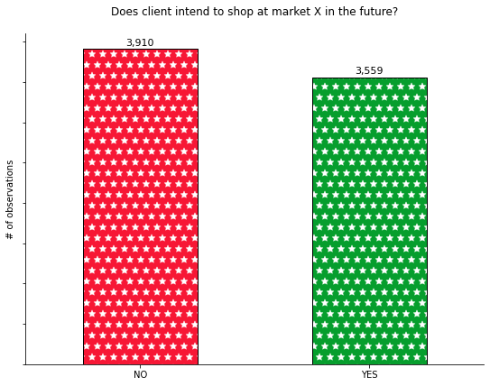

It can be inferred from the column chart that the values of the dichotomous dependent variable are fairly balanced, so there is no need to delete or generate new observations.

### Frequency of shopping vs customer retention

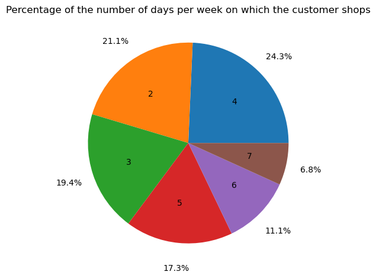

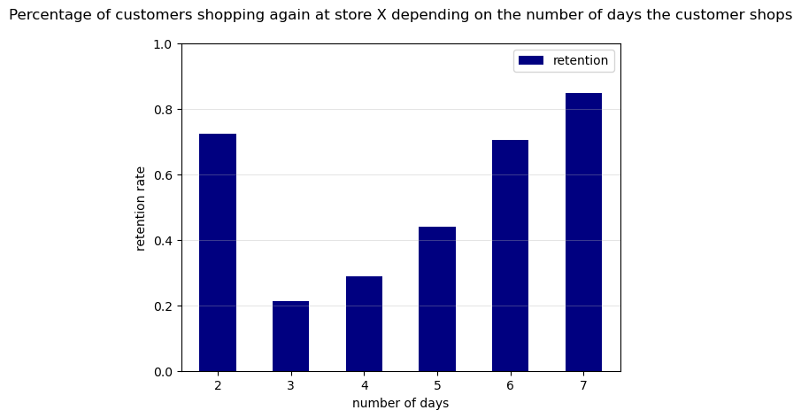

As can be seen from the graph above, the number of shopping days may have an impact on the retention of the client. With regard to two-day shoppers, it cannot be said that there is a stable trend in the number of days a person shops and the proportion of repeat purchases at store X. However, it can be concluded that the number of days is correlated with **dependent variable**.

### Credit card vs customer retention

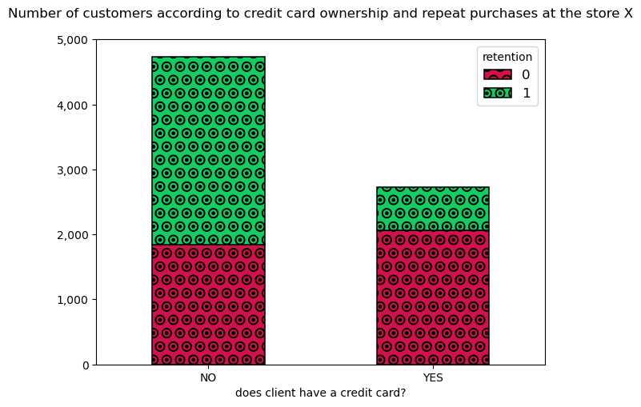

Non-credit card holders, *forming a clear majority of observations*, are considerably more likely to return to market X. The variable may therefore have an effect on the **customer retention**.

### Estimator choice

Data was splitted into train and test set with a ratio **80/20**.

Three methods were used to compare the results of the classification problem:

- Logistic Regression
- Random Forest
- Gradient Boosting

Based on the results of confusion matrices, ROC curves and the overall accuracy score,  hypertuned Gradient Boosting classifier was selected for further analysis. On the test set, this classifier scored **85.1%** (when RandomForest scored 84.7% and logistic regression scored 83.4%).

Gradient Boosting has, among the selected algorithms, a relatively large number of possible hyperparameters for tuning, but was limited to ‘only’ four, which was considered sufficient to strike a balance between underlearning and overlearning.

| Hyperparameter   | Final Value | Description                                                                                                                                                                                                                                                      |
| ---------------- | ----- | ---------------------------------------------------------------------------------------------------------------------------------------------------------------------------------------------------------------------------------------------------------------- |
| `n_estimators`     | 50    | The number of boosting stages to perform. Gradient boosting is fairly robust to over-fitting so a large number usually results in better performance.                                                                                                            |
| `min_samples_leaf` | 7     | The minimum number of samples required to be at a leaf node. A split point at any depth will only be considered if it leaves at least `min_samples_leaf` training samples in each of the left and right branches. This may have the effect of smoothing the model. |
| `max_depth`       | 3     |  The maximum depth limits the number of nodes in the tree. Tune this parameter for best performance; the best value depends on the interaction of the input variables.                                                                                           |
| `learning_rate`    | 0.1   | Learning rate shrinks the contribution of each tree by `learning_rate`. There is a trade-off between `learning_rate` and `n_estimators`.                                                                                                                               |

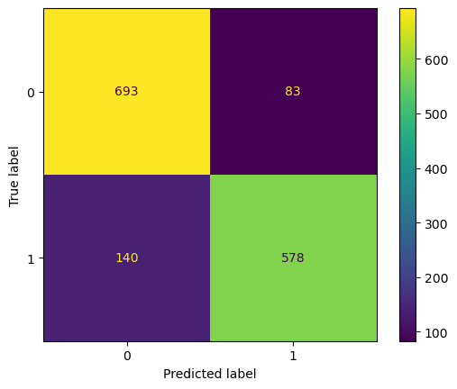

- True Positives (TP): 578 - The model correctly predicted that 578 customers would still buy (true label 1 and predicted label 1).
- True Negatives (TN): 693 - The model correctly predicted that 693 customers would stop buying (true label 0 and predicted label 0).
- False Positives (FP): 83 - The model incorrectly predicted that 83 customers would continue to buy, although they would actually stop (true label 0, predicted label 1).
- False Negatives (FN): 140 - The model incorrectly predicted that 140 customers would stop buying, although they would in fact continue to buy (true label 1, predicted 0).

**Conclusions:**
- The model performs well in predicting that a customer will stop buying (TN = 693), but makes more errors in predicting that a customer will continue to buy (TP = 578).
- The high level of false negatives (FN = 140) means that the model may not be fully effective in identifying loyal customers.

Overall, the model needs to be improved, especially in terms of reducing FN and FP errors to better predict future customer purchases.

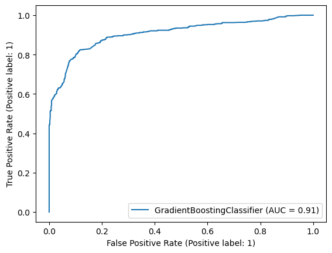

- The curve’s steep rise towards the top-left corner indicates that the classifier achieves high true positive rates with relatively low false positive rates.
- An AUC of 0.91 suggests that the model is highly effective, though not perfect, at classification.

### Feature importance

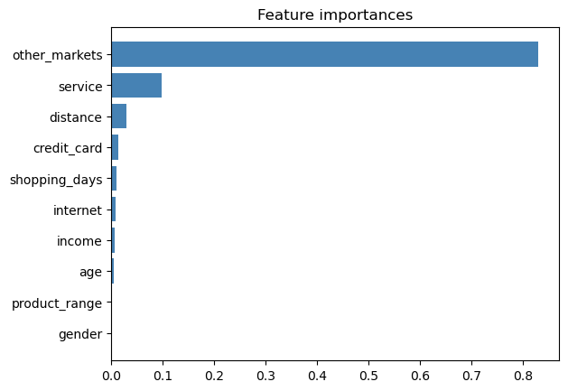

 *GradientBoosting* algorithm is much more restrictive when it comes to the importance of features - the first two, namely *other_markets* and *service*, can be simplistically assumed to be the only relevant ones.

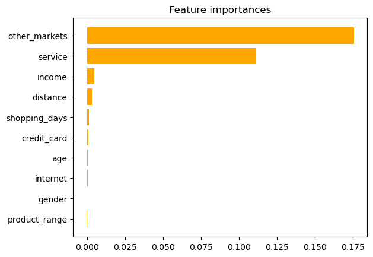

In the case of the permutation technique, similar results were obtained, at most the significance of the *service* trait was found to be significantly higher.

### Interpretation of results - SHAP package

To better understand the performance of the chosen classifier, the *SHAP* package was used.

SHAP is a method based on game theory used for enhancing transparency and interpretability of machine learning models.

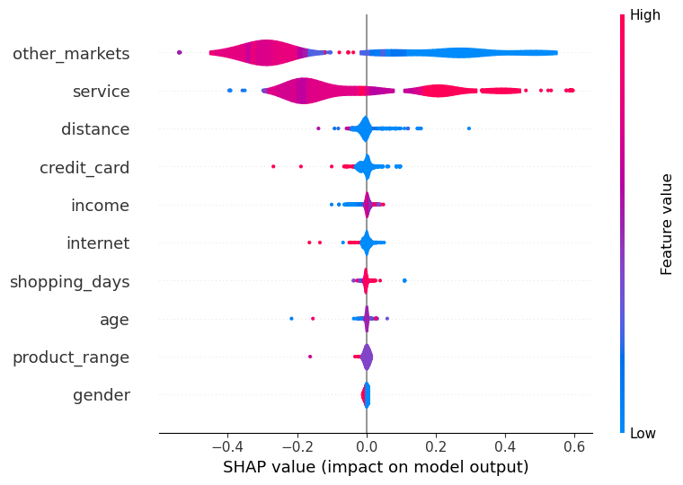

The graph shows both the relevance of the features and the density and relevance of their values. For example, the high number of other markets visited (right) contributes significantly to the underestimation of values (blue colour).

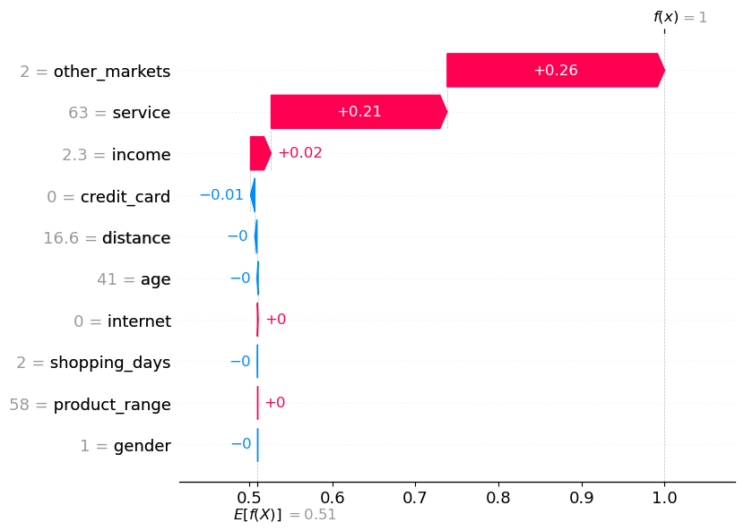

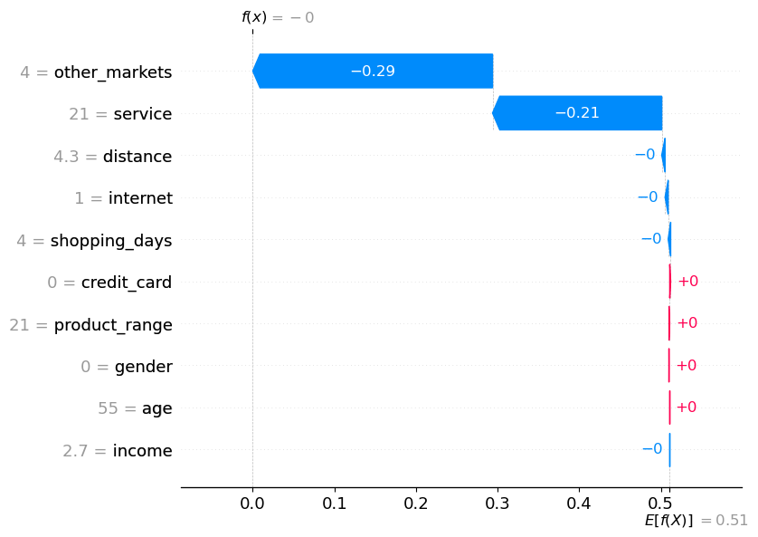

It was also decided to check how the characteristics contribute to the final prediction value for the two extreme (mainly in terms of the two most important characteristics) observations. In the case of observation *#4*, where the customer only shops at two other markets and rates the service at *63/100*, the values significantly steer the result towards a group of customers who return willingly to the market. In contrast, in the case of observation *nr 42*, where the customer shops in four other markets and rates the service of market X low (*21/100*), the algorithm is inclined to assign the customer to the group of non-returners.

## Conclusions

- The features that determine whether a customer will shop at Market X again depend mainly on how many other markets they have shopped at and their individual rating of service
- To increase the chances of customer retention it is likely necessary to increase the competitiveness of the market, including by improving e.g. the quality of service.
- Other ways could be loyalty programmes, a wider range of products available, strategic product pricing, market segmentation or increasing staff morale - satisfied staff are more likely to provide better customer service, which has a positive impact on customer retention.

In general, only helpful suggestions are listed above. To better investigate what affects the competitiveness of the markets, other data should be collected that could show important influences.